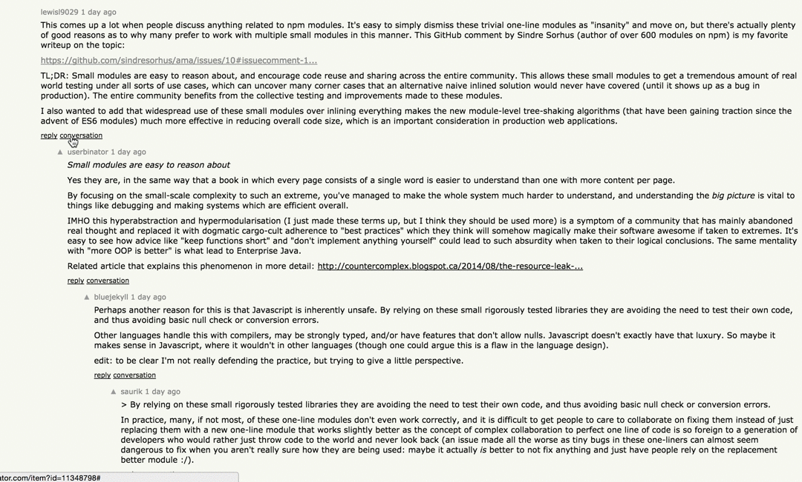

# Hacker News Coffee and Conversation
Follow a conversation between two users on Hacker News.  Popular Hacker News articles can become so bogged down with comments it is hard to track down and follow a single thread of conversation. This simple extension (which only works on Hacker News articles, items, and comments), adds an option to only show responses and posts from a comment author and the author of the comment they responded to.

## Install
For now and the foreseeable future, `git clone https://github.com/mshenfield/hacker-news-coffee-and-conversation.git`, and navigate to <a href="chrome://extensions">chrome://extensions</a>. Click "Load unpacked extensions" and select the directory where you cloned this project.

## License
[MIT](https://opensource.org/licenses/MIT) 2016-Present @ Max Shenfield
